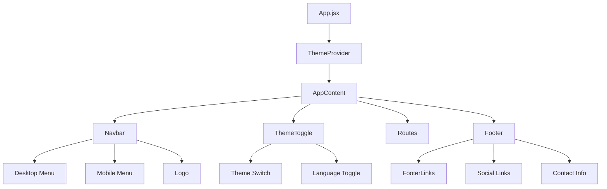
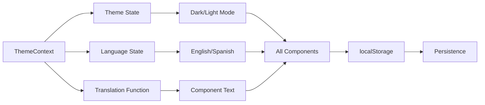
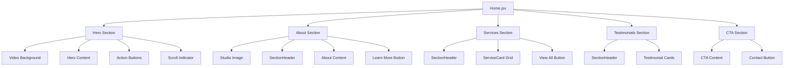

# Casa Koba Website Architecture Diagram

## 🏗️ Overall Application Structure

```
Casa Koba Music Studio Website
├── 🎯 main.jsx (Entry Point)
│   └── App.jsx (Root Component)
│       ├── 🎨 ThemeProvider (Context Wrapper)
│       └── AppContent
│           ├── 🧭 Navbar (Fixed Navigation)
│           ├── 🌓 ThemeToggle (Theme Switcher)
│           ├── 📄 Routes (Page Router)
│           └── 🦶 Footer (Site Footer)
```

## 📁 Directory Structure

```
src/
├── 🎯 main.jsx                    # React entry point with BrowserRouter
├── 📱 App.jsx                     # Main app component with routing
├── 🎨 styles/
│   ├── global.css                 # Global styles & CSS variables
│   └── theme.js                   # Styled-components theme config
├── 🧠 context/
│   └── ThemeContext.jsx           # Theme & language state management
├── 🧩 components/                 # Reusable UI components
└── 📄 pages/                      # Route-based page components
```

## 🧩 Component Architecture

### 🔧 Core Components (Always Present)



### 🎨 Reusable UI Components

```
📦 components/
├── 🧭 Navbar.jsx                 # Responsive navigation with mobile menu
├── 🦶 Footer.jsx                 # Site footer with links & info
├── 🌓 ThemeToggle.jsx            # Dark/light theme + language switcher
├── 🔘 Button.jsx                 # Versatile button component
├── 📋 ServiceCard.jsx            # Service display cards
├── 📑 SectionHeader.jsx          # Page section headers
├── 🖼️ PageHeader.jsx             # Hero-style page headers
├── 🖼️ ImageModal.jsx             # Lightbox for gallery images
├── 🎵 AudioGallerySection.jsx    # Audio samples display
├── 🔗 FooterLinks.jsx            # Footer navigation links
└── 📜 PrivacyModal.jsx           # Privacy policy modal
```

### 📄 Page Components

```
📦 pages/
├── 🏠 Home.jsx                   # Landing page with hero & sections
├── ℹ️ About.jsx                  # Company story & team info
├── 🛠️ Services.jsx               # Service listings & details
├── 🖼️ Gallery.jsx                # Image gallery & audio samples
├── 📞 Contact.jsx                # Contact form & information
├── 📜 PrivacyPolicy.jsx          # Privacy policy page
└── 📋 TermsOfService.jsx         # Terms of service page
```

## 🔄 Data Flow & State Management



### 🧠 Context System

```
ThemeContext.jsx provides:
├── 🌓 isDarkMode (boolean)
├── 🔄 toggleTheme() (function)
├── 🌍 language ('en' | 'es')
├── 🔄 toggleLanguage() (function)
├── 📝 t(key) (translation function)
└── 💾 localStorage persistence
```

## 🏠 Home Page Component Breakdown



## 🛠️ Services Page Architecture

```
Services.jsx
├── 📑 PageHeader (Hero section)
├── 🛠️ Main Services Grid
│   ├── ServiceCard (Recording)
│   ├── ServiceCard (Mixing)
│   ├── ServiceCard (Mastering)
│   ├── ServiceCard (Production)
│   ├── ServiceCard (Vocal Production)
│   ├── ServiceCard (Dolby Atmos)
│   └── ServiceCard (Post-Production)
├── 🔄 Process Section
│   └── Step-by-step workflow
└── 📞 Contact CTA Section
```

## 🖼️ Gallery Page Structure

```
Gallery.jsx
├── 📑 PageHeader
├── 🎵 Audio Samples Section
│   └── Spotify Embed
├── 🖼️ Studio Gallery Section
│   ├── Filter Buttons
│   ├── Image Grid (Filterable)
│   └── ImageModal (Lightbox)
└── 📹 Video Section
    └── YouTube Embed
```

## 🎨 Styling Architecture

```
Styling System:
├── 🎨 styled-components (Component styling)
├── 🌓 Theme system (Dark/Light themes)
├── 📱 Responsive design (Mobile-first)
├── ✨ Framer Motion (Animations)
└── 🎯 CSS Modules (Global styles)

Theme Structure:
├── 🎨 colors (Primary, secondary, backgrounds)
├── 📝 typography (Fonts, sizes, weights)
├── 📐 spacing (Margins, paddings)
├── 📱 breakpoints (Responsive breakpoints)
├── 🎭 shadows (Box shadows)
└── ⚡ transitions (Animation timings)
```

## 🔗 Component Relationships

### 🧭 Navigation Flow
```
Navbar → React Router → Page Components
├── Home (/)
├── About (/about)
├── Services (/services)
├── Gallery (/gallery)
├── Contact (/contact)
├── Privacy Policy (/privacy-policy)
└── Terms of Service (/terms-of-service)
```

### 🔄 Component Reusability
```
Button.jsx used in:
├── All page CTAs
├── Navigation actions
├── Form submissions
└── Service cards

SectionHeader.jsx used in:
├── Home page sections
├── About page sections
├── Services page sections
└── Contact page sections

ServiceCard.jsx used in:
├── Home services preview
├── Services page grid
└── About page features
```

## 🌐 Internationalization (i18n)

```
Translation System:
├── 🇺🇸 English (default)
├── 🇪🇸 Spanish
├── 📝 600+ translation keys
├── 🔄 Dynamic language switching
└── 💾 Preference persistence
```

## 📱 Responsive Design Strategy

```
Breakpoint System:
├── 📱 Mobile: < 768px
├── 📟 Tablet: 768px - 1024px
├── 💻 Desktop: 1024px - 1440px
└── 🖥️ Large: > 1440px

Mobile-First Approach:
├── Base styles for mobile
├── Progressive enhancement
├── Flexible grid systems
└── Touch-friendly interactions
```

## ⚡ Performance Optimizations

```
Performance Features:
├── 🖼️ Lazy loading images
├── 📦 Code splitting (React.lazy)
├── 🎯 Optimized animations
├── 📱 Responsive images
├── 🗜️ Compressed assets
└── ⚡ Fast loading times
```

## 🔧 Key Technologies Used

```
Frontend Stack:
├── ⚛️ React 18+ (UI library)
├── 🎨 Styled Components (CSS-in-JS)
├── 🧭 React Router (Navigation)
├── ✨ Framer Motion (Animations)
├── 🏗️ Vite (Build tool)
├── 🌐 i18n (Internationalization)
└── 📱 Responsive Design
```

---

## 📋 Summary

The Casa Koba website is built with a **modern, component-based architecture** that emphasizes:

- 🔄 **Reusability**: Shared components across pages
- 🎨 **Theming**: Dark/light mode with styled-components
- 🌐 **Internationalization**: English/Spanish support
- 📱 **Responsiveness**: Mobile-first design approach
- ⚡ **Performance**: Optimized loading and animations
- 🧠 **State Management**: Context API for global state
- 🎯 **User Experience**: Smooth animations and interactions

The architecture follows React best practices with clear separation of concerns, making it maintainable and scalable for future enhancements. 